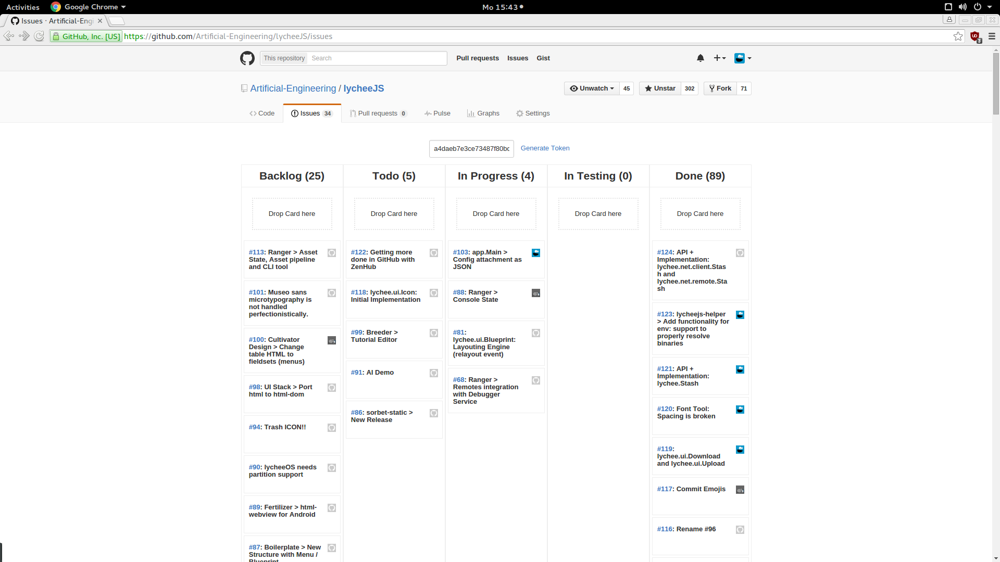

# GitHub ScrumBoard
## The minimalistic GitHub-integrated Scrum Board

brought to you as libre software with joy and pride by [Artificial Engineering](http://artificial.engineering).

Support our libre Bot Cloud via BTC [1CamMuvrFU1QAMebPoDsL3JrioVDoxezY2](bitcoin:1CamMuvrFU1QAMebPoDsL3JrioVDoxezY2?amount=0.5&label=lycheeJS%20Support).


## Overview

This chrome extension replaces the `./issues` URL of all repositories and shows
them as a Scrum Board. The Scrum Board is using `labels` and everything is using
the GitHub API.




## Features

- Only overrides the Issues overview, everything else stays the same.
- Uses GitHub labels, so everything is properly integrated.
- Uses GitHub API, so everything stays on GitHub.
- Drag and Drop allows Trello / Jira and alike behaviour.
- No third-party service is used, so everything stays on GitHub.
- Simple and minimalistic, blazing-fast.
- Libre Software, no nagging popups, no subscriptions or other crap.


```irc
@cookiengineer: Suck it, ZenHub.
@cookiengineer: You and your shitty nagging popups all the time.
```


## Installation

The extension requires a so-called GitHub Personal Access Token
in order to work. This is required, because there's no server or
any API hosted by us - so authentication will only work via those
tokens.

You can easily generate one (in less than 3 seconds) on the
[Personal Access Tokens](https://github.com/settings/tokens/new) page.

Just copy/paste the token one time into the input field shown in the
Issues page, then you're setup and ready to go.


### Chrome Web Store

As of now, this extension is not available on the Chrome Web Store.
But it will be in the near future, so stay tuned.

### Developer Mode

If you want to install the extension locally, you can install it
in Developer Mode.

- Download the [master archive]() and unzip it somewhere.
- Open Chrome / Chromium / Opera and go to `chrome://extensions`.
- Make sure `[ ✓ ] Developer mode` is active.
- Click `Load unpacked extension` and select the `AE-github-master/chrome` folder.
- Visit your project's Issues page. Click Reload (or use `[Ctrl] + [R]`).
- Generate a Token and paste it to the input field.
- That's it, you're done.


## License

GitHub ScrumBoard is (c) 2016 Artificial-Engineering and released under MIT / Expat license.
For further details take a look at the [LICENSE.txt](LICENSE.txt) file.


## Contributing

Feel free to fork this project, Pull-Requests are always welcome!


## Work in Progress

Here's a short list what might don't work and needs some tweaks:

- The wrapper with the token input field shall be hidden and visible only if `\_get\_token()` fails.

